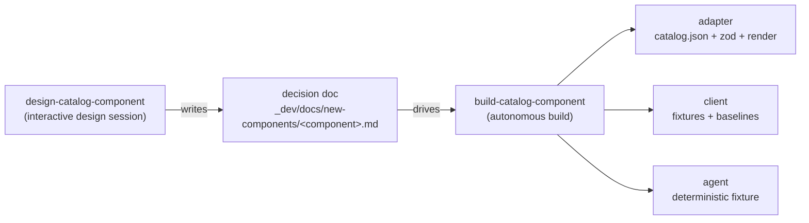

# github-catalog

The A2UI catalog and React adapter for [Primer](https://primer.style/),
targeting protocol **v0.9.1**, built over
[`@a2ui/react`](https://www.npmjs.com/package/@a2ui/react) /
[`@a2ui/web_core`](https://www.npmjs.com/package/@a2ui/web_core). It ships two
halves of one contract:

- **`catalogs/v0.9.1/catalog.json`** — the hand-authored catalog document: the
  JSON-Schema description of every component and function an agent may emit,
  with prop semantics written for a model reader. This is what an agent
  generates against.
- **`src/`** — the client half: a zod schema and a Primer-rendering React
  implementation per component, plus the local function implementations,
  assembled into the `CATALOG` object a renderer consumes.

## Exports

The package exports three things:

```ts
import {CATALOG, CATALOG_ID, Provider} from 'github-catalog';
```

- **`CATALOG`** — the assembled `Catalog` object: every component
  implementation and every client-side function, ready to hand to an A2UI
  message processor.
- **`CATALOG_ID`** — the catalog URI: this package's repo-path URL, the same
  string as the `catalogId` field inside `catalog.json`; a surface stamped with
  it declares "render me with this catalog".
- **`Provider`** — Primer's theme + base styles, with the Primer token
  stylesheets loaded on first mount. A host wraps each of this catalog's
  fragments in it; the bundle owns this setup, the host registers nothing.

  It is also what makes this catalog safe to render **beside** another one. Its
  tokens are scoped to its own wrapper rather than written to `:root`, and it
  anchors Primer's portal root inside that wrapper — so overlays open themed and
  inside the fragment they belong to, instead of escaping to the end of `body`
  where they would render unthemed over someone else's surface. The platform's
  collision detector fails the build if either property regresses.

The bundle ships Primer itself (`@primer/react`, octicons, primitives) at exact
versions. A host supplies only the shared runtime that must be a singleton:
React, `@a2ui/react` / `@a2ui/web_core`, and `zod`.

**In the client**, `CATALOG` powers rendering and `CATALOG_ID` identifies
surfaces:

```tsx
import {MessageProcessor} from '@a2ui/web_core/v0_9';
import {A2uiSurface} from '@a2ui/react/v0_9';
import {CATALOG, CATALOG_ID, Provider} from 'github-catalog';

const processor = new MessageProcessor([CATALOG], actionHandler);
// a surface opens against this catalog:
//   {version: 'v0.9', createSurface: {surfaceId: '…', catalogId: CATALOG_ID}}
// …feed A2UI messages into the processor, then render inside the Provider:
<Provider>
  <A2uiSurface surface={surface} />
</Provider>;
```

**In the agent** (Python, outside the pnpm workspace), the same contract is
consumed as the document rather than the code: `agent/catalog_common` locates
`github-catalog/catalogs/v0.9.1/catalog.json` by path and uses it for
prompt assembly and output validation, and the surfaces the agent emits carry
that document's `catalogId` — the same string as `CATALOG_ID`.

## What's in the catalog

**146 component entries** — Primer components and their compound children,
spanning content leaves, buttons and toolbars, form controls, lists and menus,
containers, navigation, page scaffolding, and overlays — and **19 client-side
functions** (effects, validations, formatting, boolean logic) runnable with no
agent round trip. The full family-by-family listing is in the
[catalog inventory](#catalog-inventory) at the bottom of this doc.

## Layout

```
catalogs/v0.9.1/catalog.json   the catalog document (the agent-facing contract)
src/
  catalog.ts                   assembles CATALOG from all implementations
  catalog-id.ts                CATALOG_ID
  catalog.registry.ts          the component/function registry the tests walk
  catalog.parity.test.ts       zod ↔ catalog.json parity
  catalog.test.ts              exact-set catalog smoke test
  components/<name>/           one dir per component entry:
                                 <name>.schema.ts   zod prop schema (+ test)
                                 <name>.tsx         Primer render (+ test)
  functions/                   one <name>.ts + test per client-side function
  shared/                      cross-component helpers (child lists, coercion,
                               slot contexts, layout plumbing)
```

## Testing

Two catalog-level tests keep the two halves honest, driven by the registry in
`catalog.registry.ts`:

- **Parity** (`catalog.parity.test.ts`): for every registry entry, the zod
  schema and the `catalog.json` entry must agree — discriminator consts equal
  their keys, required-ness matches, `returnType` consts hold.
- **Exact set** (`catalog.test.ts`): the assembled `CATALOG` contains exactly
  the registry's component and function sets — nothing missing, nothing extra.

Per-component tests live beside each implementation: schema tests for prop
validation, render tests (vitest + RTL, jsdom) for the Primer output.

## Commands

```bash
pnpm --filter github-catalog build      # tsc → dist/ (also runs as `prepare` when installed from git)
pnpm --filter github-catalog typecheck
pnpm --filter github-catalog test       # vitest
```

Consumers take the package straight from this repo — no registry:

```json
"github-catalog": "github:retz8/a2uiverse-apps#path:github/github-catalog"
```

## Adding a component

Component authoring is a two-step workflow captured as repo skills — an
interactive design session locks every decision into a per-component doc, and
an autonomous build materializes that doc across all three surfaces:



Both skills live under `.claude/skills/`.

## Catalog inventory

The full component set, by family — a family root and the child entries that
compose under it, named exactly as they appear in `catalog.json`.

### Content & display leaves

| Entry             | Compound children |
| ----------------- | ----------------- |
| `Text`            | —                 |
| `Heading`         | —                 |
| `Link`            | —                 |
| `BranchName`      | —                 |
| `RelativeTime`    | —                 |
| `Label`           | —                 |
| `StateLabel`      | —                 |
| `CounterLabel`    | —                 |
| `Token`           | —                 |
| `IssueLabelToken` | —                 |
| `Avatar`          | —                 |
| `Icon`            | —                 |
| `Spinner`         | —                 |
| `ProgressBar`     | —                 |
| `SkeletonBox`     | —                 |
| `Truncate`        | —                 |
| `KeybindingHint`  | —                 |

### Buttons & toolbars

| Entry              | Compound children                                                                |
| ------------------ | -------------------------------------------------------------------------------- |
| `Button`           | —                                                                                |
| `IconButton`       | —                                                                                |
| `ButtonGroup`      | —                                                                                |
| `SegmentedControl` | `SegmentedControlButton`, `SegmentedControlIconButton`                           |
| `ActionBar`        | `ActionBar.IconButton`, `ActionBar.Group`, `ActionBar.Menu`, `ActionBar.Divider` |

### Form controls

| Entry           | Compound children                                                                             |
| --------------- | --------------------------------------------------------------------------------------------- |
| `Checkbox`      | —                                                                                             |
| `Radio`         | —                                                                                             |
| `ToggleSwitch`  | —                                                                                             |
| `Textarea`      | —                                                                                             |
| `TextInput`     | `TextInput.Action`                                                                            |
| `Select`        | `SelectOption`, `SelectOptGroup`                                                              |
| `Autocomplete`  | `Autocomplete.Input`, `Autocomplete.Overlay`, `Autocomplete.Menu`                             |
| `FormControl`   | `FormControlLabel`, `FormControlCaption`, `FormControlValidation`, `FormControlLeadingVisual` |
| `CheckboxGroup` | `CheckboxGroupLabel`, `CheckboxGroupCaption`, `CheckboxGroupValidation`                       |
| `RadioGroup`    | `RadioGroupLabel`, `RadioGroupCaption`, `RadioGroupValidation`                                |

### Lists & menus

| Entry         | Compound children                                                                                                                                                                                                                                   |
| ------------- | --------------------------------------------------------------------------------------------------------------------------------------------------------------------------------------------------------------------------------------------------- |
| `ActionList`  | `ActionList.Item`, `ActionList.LinkItem`, `ActionList.Group`, `ActionList.GroupHeading`, `ActionList.Heading`, `ActionList.LeadingVisual`, `ActionList.TrailingVisual`, `ActionList.TrailingAction`, `ActionList.Description`, `ActionList.Divider` |
| `ActionMenu`  | `ActionMenu.Anchor`, `ActionMenu.Button`, `ActionMenu.Overlay`, `ActionMenu.Divider`                                                                                                                                                                |
| `SelectPanel` | `SelectPanel.Item`                                                                                                                                                                                                                                  |

### Containers & grouping

| Entry         | Compound children                                                                                                                    |
| ------------- | ------------------------------------------------------------------------------------------------------------------------------------ |
| `Stack`       | `StackItem`                                                                                                                          |
| `LabelGroup`  | —                                                                                                                                    |
| `AvatarStack` | —                                                                                                                                    |
| `Details`     | —                                                                                                                                    |
| `Timeline`    | `TimelineItem`, `TimelineBadge`, `TimelineAvatar`, `TimelineBody`, `TimelineActions`, `TimelineBreak`                                |
| `TreeView`    | `TreeViewItem`, `TreeViewSubTree`, `TreeViewLeadingVisual`, `TreeViewTrailingVisual`, `TreeViewDirectoryIcon`, `TreeViewErrorDialog` |

### Navigation

| Entry          | Compound children                                                                                                                                                                                                       |
| -------------- | ----------------------------------------------------------------------------------------------------------------------------------------------------------------------------------------------------------------------- |
| `Breadcrumbs`  | `BreadcrumbsItem`                                                                                                                                                                                                       |
| `NavList`      | `NavList.Item`, `NavList.SubNav`, `NavList.Group`, `NavList.GroupHeading`, `NavList.GroupExpand`, `NavList.LeadingVisual`, `NavList.TrailingVisual`, `NavList.TrailingAction`, `NavList.Description`, `NavList.Divider` |
| `UnderlineNav` | `UnderlineNav.Item`                                                                                                                                                                                                     |
| `Pagination`   | —                                                                                                                                                                                                                       |

### Page scaffolding

| Entry             | Compound children                                                                                                                                                                                                                                                                                                                                                            |
| ----------------- | ---------------------------------------------------------------------------------------------------------------------------------------------------------------------------------------------------------------------------------------------------------------------------------------------------------------------------------------------------------------------------- |
| `PageLayout`      | `PageLayout.Header`, `PageLayout.Content`, `PageLayout.Pane`, `PageLayout.Sidebar`, `PageLayout.Footer`                                                                                                                                                                                                                                                                      |
| `SplitPageLayout` | `SplitPageLayout.Header`, `SplitPageLayout.Content`, `SplitPageLayout.Pane`, `SplitPageLayout.Sidebar`, `SplitPageLayout.Footer`                                                                                                                                                                                                                                             |
| `PageHeader`      | `PageHeader.ContextArea`, `PageHeader.ParentLink`, `PageHeader.ContextBar`, `PageHeader.ContextAreaActions`, `PageHeader.TitleArea`, `PageHeader.LeadingAction`, `PageHeader.LeadingVisual`, `PageHeader.Title`, `PageHeader.TrailingVisual`, `PageHeader.TrailingAction`, `PageHeader.Actions`, `PageHeader.Breadcrumbs`, `PageHeader.Description`, `PageHeader.Navigation` |

### Overlays

| Entry                | Compound children                                                                                                   |
| -------------------- | ------------------------------------------------------------------------------------------------------------------- |
| `Dialog`             | `DialogHeader`, `DialogTitle`, `DialogSubtitle`, `DialogBody`, `DialogFooter`, `DialogButtons`, `DialogCloseButton` |
| `ConfirmationDialog` | —                                                                                                                   |
| `Popover`            | `PopoverContent`                                                                                                    |
| `AnchoredOverlay`    | —                                                                                                                   |

### Client-side functions

Local effects (`openUrl`, `setBoolean`, `clearValue`, `windowAlert`,
`consoleLog`), validations (`required`, `length`, `numeric`, `email`,
`regex`), formatting and computation (`formatString`, `formatNumber`,
`formatCurrency`, `formatDate`, `pluralize`, `countSelected`), and boolean
logic (`and`, `or`, `not`).
